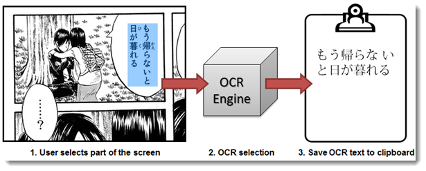

# DOMBHA-OCR-Explorer
OCR Data Explorer

OCR (Optical Character Recognition) is a technology that allow you to convert image to text. In this part we use Deep Learning and to train a model with computer generated dataset.

You can acces the data from [UCI Machine Learning Repo](https://archive.ics.uci.edu/ml/datasets/Character+Font+Images).

Main purpose of this project is to automatically recognize of manga/manhwa/comic character image and generate the text of it's image.

	

